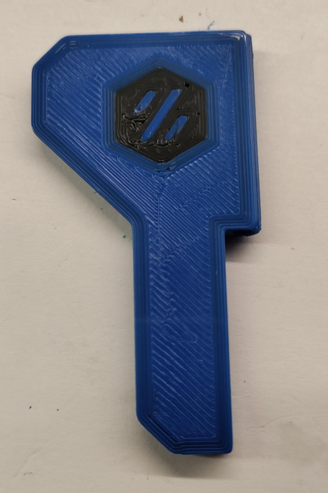

Manual multicolor logo for 3mm_Hinge_Top_A.

Load accent color.

Position front-right-hinge-logo.stl on the exact spot of the logo voids in your slicer. Print.

Keep your bed hot.

Slice the hinge.

Change filament to primary color.

Print hinge.

Result:

